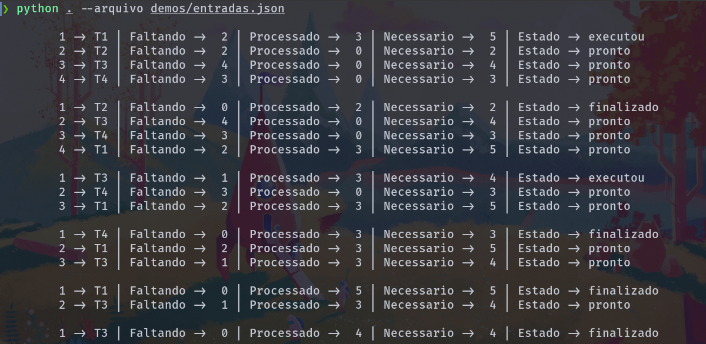
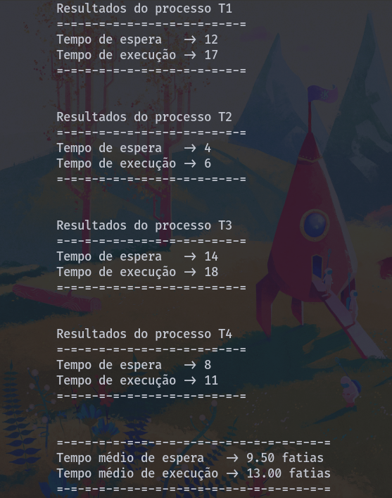

# **Round Robin**

> Algoritmo de escalonamento Round Robin desenvolvido durante a disciplina de Sistemas Operacionais no Instituto Federal do Piauí - IFPI.

## Executar

```bash
# via console
$ python3 -B . # ou python3 -B __main__.py
# via arquivo json
$ python3 -B . --arquivo caminho/ate/arquivo.json
```

### Demonstração




